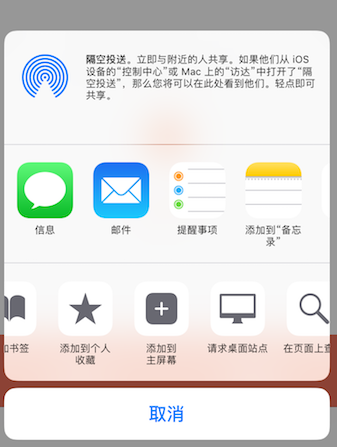
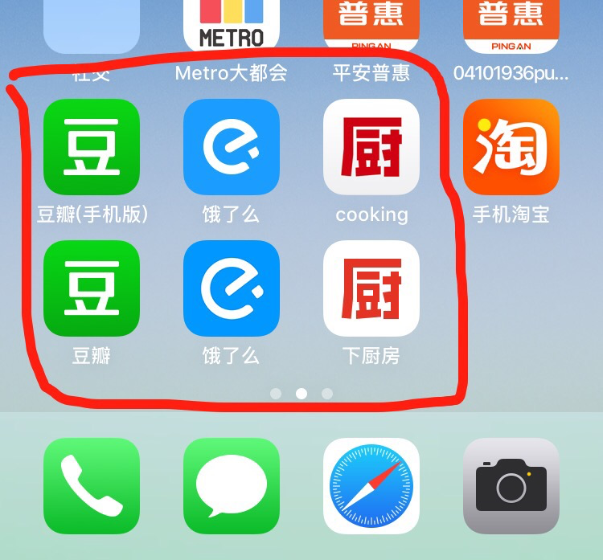

### 一、PWA简介
**1) 背景**

当前web应用劣势：
1. 无独立入口，依赖浏览器
2. 无法离线使用
3. 用户体验无法媲美Native（网络下载）
4. 无消息推送功能

**2) PWA 是什么**
> 全称为Progressive Web Apps（渐进式web APP），是一种提升 Web App用户体验的新方法，能给用户原生应用的体验。  
PWA不指某一项技术，包括一系列关键技术,可以让web APP拥有Native APP的特征。

**3) PWA 解决什么问题**  
*改善用户体验，媲美Native*
1. 离线使用：提高加载速度，缓存技术结合（Service Worker）实现离线使用
2. 可安装：不依赖浏览器作为入口，添加主屏幕，全屏执行（Web App Manifest）
3. 消息推送：未启用应用时主动发送推送通知（Push Notification ）

**4) PWA 特征**

> Reliable  - Load instantly and never show the downasaur, even in uncertain network conditions.  
可靠 - 即使在不确定的网络条件下，也能立即加载并永不显示停机   
Fast  - Respond quickly to user interactions with silky smooth animations and no janky scrolling.   
快速 - 以平滑动画的交互快速响应用户，不会晃动滚动。   
Engaging  - Feel like a natural app on the device, with an immersive user experience.  
粘性 - 感觉就像设备上的自然应用一样，具有身临其境的用户体验

### 二、应用案例

1. 豆瓣：https://m.douban.com/  
2. 饿了么： https://h5.ele.me/

### 三、项目要解决的实际问题
* 在线资源的离线缓存  
* 方案之一：Service Worker


### 四、关键技术之Web App Manifest
**1） 功能**    
解决web应用入口问题, 使 web 应用能够像原生应用一样被添加到主屏、全屏执行  
**2）定义**  
Web App Manifest是一个json格式的文件清单，定义应用程序的相关数据，比如：名称，作者，图标等等。

**3）使用**
1. 添加manifest.json
```
<link rel="manifest" href="/manifest.json">
```
2. 定义manifest.json
```
{
  "name": "appName", //APP name
  "short_name": "cooking", //APP Name简称
  "start_url": "../home.html", //pwa启动入口页
  <!-- 访问模式 -->
  "display": "standalone",
  "background_color": "#fff", //背景色
  <!-- pwa访问范围，作用域外的 URL 就会打开浏览器而不会在当前 PWA 里继续浏览。饿了么应用，只可访问一个页面 -->
  "scope": "../",
  "description": "A simply app for searching cookbooks.",
  <!-- 桌面图标定义 IOS不支持 IOS其他方式指定 -->
  "icons": [{
    "src": "../images/app-icon.jpg",
    "sizes": "48x48",
    "type": "image/jpg"
  },{
    "src": "../images/app-icon.jpg",
    "sizes": "52x52",
    "type": "image/jpg"
  }]
}
```
3. 实例  
iOS 没有提示，需手动添加 



pwa应用和原生应用桌面图标对比    
第一排：pwa应用；第二排：原生应用 

  

### 五、核心技术之Service Worker
**1）定义**
>    Service Worker是浏览器在后台独立于网页运行的一段JavaScript脚本.

**2）主要功能**  
* web APP实现持久离线缓存，离线内容开发者可控，（缓存机制依赖 Cache API ）pwa 应用离线使用的核心技术
* 独立于网页的worker线程，可拦截和处理网络请求（依赖HTML5 fetch API）
* 向客户端推送消息（Web Push）  

**3）部分特性**  
* 不能直接操作 DOM
* 安全，必须在HTTPS下才能工作（localhost例外）
* 异步实现，内部大都是通过 Promise 实现

**3）兼容性**  
* [点击查看浏览器支持情况](https://jakearchibald.github.io/isserviceworkerready/)  
* [iOS 11.3 和 macOS 10.13.4开始支持IOS，点击这里查看相关文章 ](https://juejin.im/post/5a695fb7f265da3e5234b2d6)  

**4）简介**


**5）生命周期**  
注册 ——> 安装 ——> 激活 ——> 监听事件【事件驱动】 ——> 销毁

* 支持的事件  
install、activate、message（postMessage API）、fetch、push（ Notification API 和 PUSH API）、sync

**5）实践**  
当第一次加载页面时，Service Worker 还没有激活，所以它不会处理任何请求。只有当它安装和激活后，才能控制在其范围内的一切。这意味着，只有你刷新页面或者导航到另一个页面，Service Worker 内的逻辑才会启动。

开发工具 chrome://inspect/#service-workers


是什么
解决什么问题【技术出现的背景和目的】
应用案例
我们为什么要使用【某个技术解决我们自己实际的问题】
怎么做？如何接入？
收益【期望，打点拿数据】

### 六、关键技术之Web Push

### 附录
######  1）博客  
1. [PWA 将带来新一轮大前端技术洗牌？](https://openweb.baidu.com/pwa-future/)  
2. [下一代 Web 应用模型 —— Progressive Web App](https://huangxuan.me/2017/02/09/nextgen-web-pwa/)  

######  2）教程  
1. [google官网](https://developers.google.cn/web/progressive-web-apps/)  
2. [百度pwa教程](https://lavas.baidu.com/pwa)  
3. [MDN](https://developer.mozilla.org/zh-CN/docs/Web/API/Service_Worker_API/Using_Service_Workers)

######  3）书籍  
1. [第一本中文PWA](https://github.com/SangKa/PWA-Book-CN)（官方告示预计2018年5月份正式出版）
